# Algorithm of Reinforcement Learning for Imperfect Information Card Game: Gin Rummy

<!-- ## Current Work and Code:

------------- -->
<!-- 
## Past Work and Code:
* Please navigate to `/ginrummy/hand_estimation_model.ipynb` to see what I'm working on with hand estimation lstm model.
    * I trained lstm model with 4 inputs in different versions. All of them achieve an accuracy of about 78%. The model has been estimating mostly accurate opponent hands with just some noise here and there.
    
    * LSTM model trained ~2000 matches, 100 epochs, achieve an accuracy of 76%.

    * LSTM model trained ~4000 matches, 150 epochs, achieve an accuracy of 78%.

    * TODO: For future implementation, research more on bias on cards that are in meld with opponent action as another non-lstm input!

* Please navigate to `/ginrummy/GinRummyMavenProject/HandEstimationModel.java` to see what I'm working on with hand estimation lstm model.
    * I write this from scratch without any usage of library. I don't want to use any library because I want to deeply understand process of neural networks.
    
    * This model takes an input of observation of the opponent move, and output an estimated opponent hand. (For more information, please navigate to the documentation I have written in the file or navigate to report 5).

    * This file is being finished. TODO: Finish the back-propagation process, and prediction algorithms.

* Please navigate to `/ginrummy/GinRummyEAAIorigin/GinRummyEAAI/CFRPlayer.java` to see what I'm working on.
    * This player use simple probability estimation algorithm stated from `week 2 report` including opponent hand estimation by Bayes Theorem. And Flipping and Masking to map that estimation to strategy.
    
    * Currently, this player has win rate of 30% matches over simple player in ONE game. And over the course of 1000 games, this player won 0 game over simple player.

* Please navigate to `/ginrummy/GinRummyEAAIorigin/GinRummyEAAI/PlayerModel.java` to see what I'm working on.

    * This is the model I write based on what I read about Temporal Difference technique in Reinforcement leanring in Gin Rummy according to [TD-Rummy paper](https://www.aaai.org/Papers/ICML/2003/ICML03-050.pdf).

    * This file includes a feed forward ANN with input is state vector in `Report 3, part 1, bullet point 1,` and the output is one simple value determine the value of that state.

    * Through the course of the game, the player will learn this value function and base on that to determine each action.

    * Read more about this on `Report 3, part 4.`

--------------- -->

# Report:
## Report 9, date: Aug 16, 2020

1. Accuracy of card value data generation:
- In the last few days I have done some experiement on generating play data concerning **Turn**, **Card Rank**, and **Number of meld hit** at each turn.

- I then try to find the relation of each type of data to **The number of turn left**, **The distance from the card rank to 10 (Max deadwood)**, **The number of meld was potentially formed with known cards throughout each match**, respectively by collecting data points from about 6000 games.

- Turn and turn-left relationship:

    * The scatter plot of the relationship between turn and turn left. (x: turn, y: turn-left)
    
    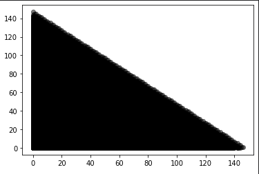

    * The scatter plot of the relationship between turn and turn left PREDICTED (which works fine!)

    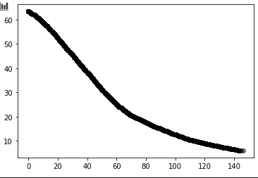

- Card rank and rank distance relationship: For this, the function is heuristic so there is no need to find a regression function.

- Meld hit and potential meld formed: this is actually a hard case because there is just no pattern.

    * The scatter plot of the relationship between meld hit and meld formed with known cards in the end of a match. (x: meld hit, y: meld formed)

    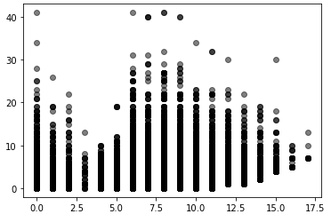

    * here is the prediction (which makes no sense)

    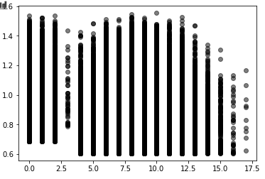

2. Conclusion: I think that there woulbe no relationship between the number of meld formed and hit, so it is really hard calcluating the actual value of an actual card. Do you have any suggestion about the output that I have to generate?

## Report 8, date: July 14, 2020

Please navigate to [this link](./reference/report8.pdf) to see report 8.

In addition to the report I will put on the paper, I did make some experiment of diving in how gin rummy players accumulate their strategy. I had a chance to implement Knocker bot, Hitting bot, Estimator Bot

### 1. Knocker bot:

As I said earlier in the report 8, I trained a neural network with the knocking behavior of the simple gin rummy player, and make it so that they can win with undercut opponent. The knocker bot predict not knock or not when the deadwood point are smaller than 10.

### 2. Hitting bot:

Hitting bot keeps track of the cards that are in the opponent hand and the discard pile throughout each turn, and create a "wall" matrix of card that the player can not pick to form or collecting melds. Using the data that of the hitting bot, the player know everything about current hitting cards in hand and can collect hitting cards as well as discarding the right card! In the future, the hitting bot will take advantage of the data generated by opponent hand estimator.

### 3. Let's play with each other

* `SimplePlayer1` (SP1): Original example player. Only pick up when the card form meld, and only discard the highest non-meld card.
* `SimplePlayer2` (SP2): Simple player 1 with `HandEstimatorBot` and `KnockerBot` function (Threshold = 0.99). Always knock the last!
* `SimplePlayer3` (SP3): Simple player 2 with `HittingBot` and `KnockerBot` function (Threshold = 0.85). Wisely draw card, and choose the right time the knock!
* `SimplePlayer4` (SP4): Simple player 3 with `HittingBot` function. Wisely draw card and wisely discard (not discarding base on opponent hand estimation)!

Let's playezz 100 matches among each others! And here is the win rate (of players in column over those in row) :

|     | SimplePlayer1 | SimplePlayer2 | SimplePlayer3 | SimplePlayer4 |
|:---:|:---:|:---:|:---:|:---:|
| SimplePlayer1 | 50% | 36% | 39% | 48% |
| SimplePlayer2 | 64% | 50% | 37% | 50% |
| SimplePlayer3 | 61% | 63% | 50% | 59% |
| SimplePlayer4 | 52% | 50% | 41% | 50% |

## Report 7, date: July 7, 2020

Please navigate to [this link](./reference/report7.pdf) to see report 7

## Report 6, date: June 30, 2020
### 1. LSTM Trainer:

* First, I generate game data in JSON format in JAVA. then I preprocess them in python.

* I then build model, train, and experiment with different kinds of model.
    * First, I use my 4 inputs that I have mention in [previous report](##-Report-5,-date:-June-23,-2020), and create these following model.

    * Model 1: 4 inputs map to 4 different parallel LSTM layer, and then concatenated and go through 1 dense layer
    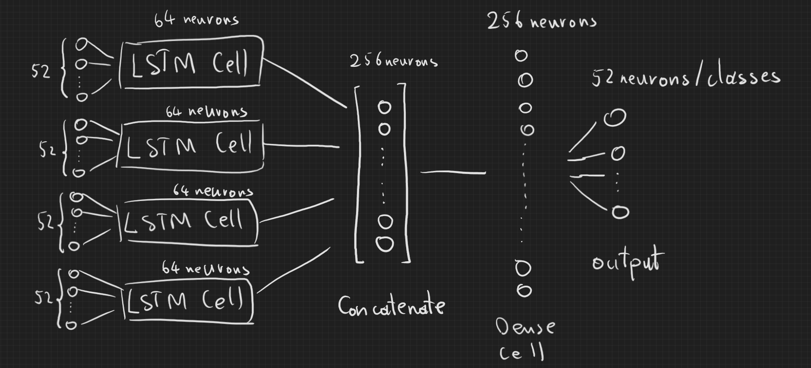

    * Model 2: 
    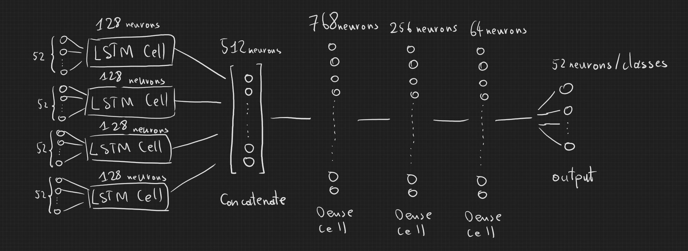
    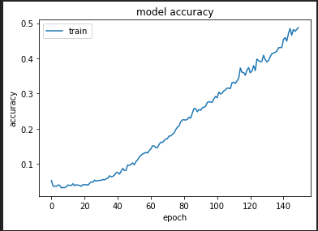
    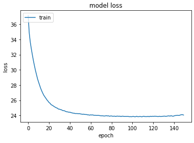

    * Model 3: 
    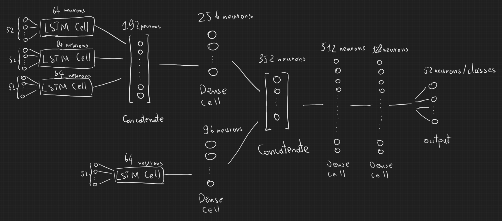

* I then import the model to java and start predicting, here is the result:

    * The result of the best model achieve an accuracy of 77% can predict mostly opponent hand from turn 3 and away. The prediction has some noise here and there due to lacking information about which card was picked by the opponent from the draw pile. There sometimes there is just no clue!

    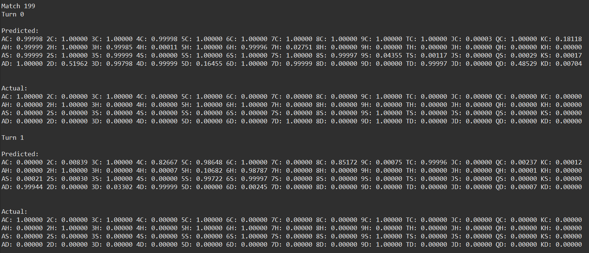
    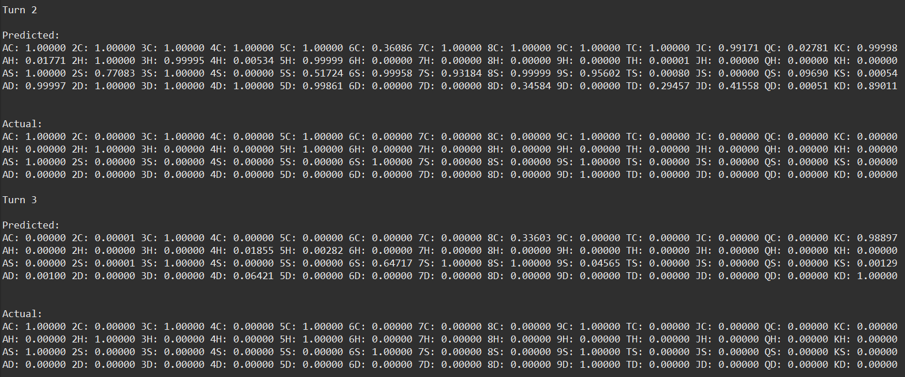
    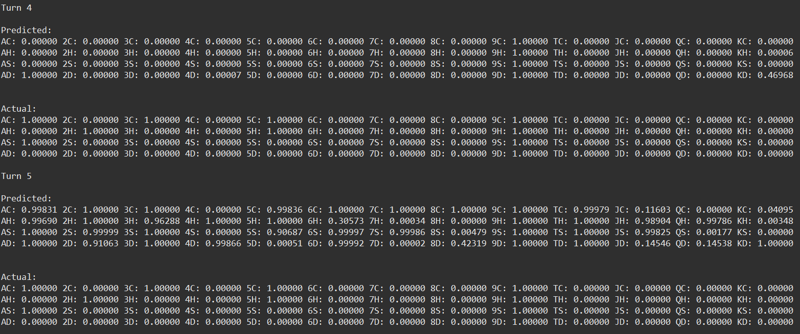

## Report 5, date: June 23, 2020
### 1. Turn State Representation of Opponent's action (Also available in the file `HandEstimationModel` documentation).

* There will be 4 inputs. Each is a vector of length 52 (one-hot encoded).

    * Vector of cards the opponent discarded this turn
    * Vector of cards that the opponent does not care about (not picking up from discard pile) this turn.
    * Vector of cards that the opponent does care and pick up from the discard pile.
    * Cards that are on this player's hand and in the discard pile.

* There will be one output: vector of length 52, containing one-hot encoded opponent hand.

### 2. Hand Estimation modeling:

* The four input collected in the games are feed into the model:
    * First, each input vector go to a lstm cell that remember the predicted opponent hand in relation with the each input.

    * The output of all lstm cells are then concatenated into a single vector.

    * The vector is then feeded into the feed forward dense network with dynamic layers.

* Custom Loss Function - Augmented Categorical Cross Entropy:
    
    * The basics of categorical cross entropy:
    
    

    

    * The problem of this loss function is that it consider all errors at every classes the same. However, in this particular Gin Rummy case, we only want to estimate each card if we have some clue of them in the input. Say it another way, we can only be able to estimate which card the opponent have in hand if we know the existence of some of the cards.

    * Therefore, to solve this problem, we need to make cards that are relevant to the input cards, and we also want to make unrelated card more trivial.

    * So I suggest having a function called `get_related_importance(input)` which takes in 4 inputs and returns a vector of length 52 representing the importance of our prediction of that card.

    * I also suggest that the formular will be:

     
-------------
## Report 4, date: June 17, 2020
### 1. Observation Representation (Also available in the file `HESimpleModel` documentation):

* state -3: known card that is not in opponent hand. (Eg. cards on current player hand, card in the discard pile)

* state -2: The opponent does discard the card.

* state -1: The opponent does not care about the card.

* state 0: This is the unrelated card.

* state 1: The opponent does care and pick up the card.

### 2. Hand Estimation using fully connected deep neural network.

* This is a hand crafted simple fully connected neural network
	with fixed 2 layer. The first layer has input is the input and
	output 64 neurons. The second layer has input which is output of
	the first layer, and spit out a single value!

    * @param: X (float[][]): Shape (none, 52). With 52 cards represented by state:
        * state -3: known card that is not in opponent hand. (Eg. cards on current player hand, card in the discard pile)
        * state -2: The opponent does discard the card.
        * state -1: The opponent does not care about the card.
        * state 0: This is the unrelated card.
        * state 1: The opponent does care and pick up the card.
	* @param: Y (float[][]): Shape (none, 52). With 52 cards represented by state:
		* state 0: The opponent does not have this card in hand.
		* state 1: The opponent does have this card in hand.
	* @param: seed (int): Random seed for nothing
	* @param: lr (float): the learning rate!
	* @param: n_iter (int): number of episode to be trained.

* Current TODO list:

	1. Add bias variables for every weights.

	2. Working on back-propagation method:
		- Solve the dE/dW in the first layer where having to differentiate sigmoid function.
		- Fix bug or re-implement the whole function.
		- Methodize derivative function for better readable code.
			- Sigmoid_derivative
			- Softmax derivative
	    	- Categorical cross entropy derivative.
			- Linear Regression Sum derivative.
    	- On back-propagating, research more on gradient descend and ascend, -= or +=.
		- Currently hard coding the number of layers. Need to write method that dynamically compute tye number of layers.

    3. Work on custom loss function:

        * It is because since we cannot exactly estimate the opponent hand, and sometime there is no clue (opponent don't discard or draw any card that directly related to those cards, or the opponent forms meld right from the start.). Therefore, we cannot calculate the loss by the normal categorical cross entropy loss function.

        * Prospective further research can be modified categorical cross entropy: the loss only care about the cards that are related to the opponent's action on a particular card.

	3. Write Predicting method

	4. Test thoroughly

* Current result:

    * This model achieves hand estimation

* Current Drawbacks:
    
    * The model is very simple, each turn is trained separately, therefore, no memory of previous turns.

    * Therefore although the model can predict the probability of opponent not having related cards in melds, it cannot keep track of previous data.

### 3. Hand Estimation using Sequential Neural Network Model:

* Proving that Hand Estimation process is a sequence of data:

    * Since each we collect data each turn, and we are not only depending on the data at that turn to predict opponent hand, but we are also using the data, prediction from the previous turns in the game.

    * Therefore, the process of estimating opponent hand is sequential. So we should use some kind of neural network that understand the context formed by a sequence of data.

* Approach for further research is:
    * Recurrent neural network.
    * Long short-term memory.
    * GRU neural network.

### 4. Understanding a hand features/ traits with generative model.

* Proving that understanding a hand value is the problem of generative model:

    * Considering a hand with meld 7H, 8H, 9H, 8C, 8D, these two melds form a "plus" sign on the card table. Now consider another hand with 7H, 8H, 9H, 8C, 8S (not 8D), these also form a plus sign on the card table and have pretty good the same trait with the previous hand.

    * What I mean here is the to understand how valuable one hand is, one must not consider each card as it is in a particular meld or shape because the shape can be varied by the combination of how we arrange the card rows.
    
    * Therefore, to understand the actual value of a hand, we need to deeply generalize a hand feature, not just looking into its combination with other particular cards.

*  Approach for further research:

    * Variational auto-encoder.
    * Generative adversarial network.

------------
## Report 3, date: June 9, 2020
### 1. Modeling the abstraction of the public state. State Representation.

* The state will be a vector of length 52. Each element is a card. Each element have 4 state, `in-player-hand`, `in-opponent-hand`, `in-discard-pile`, and `unknown`. Each card will be represented by 1 in these 4 states, with `integer` representation. So there are roughly 2x10^31 different states. NOTE: the card is only considered to be in opponent hand if it is picked by opponent from the discard pile. Other cards are unknown.

* One other way we can represent states is probability representation. The state can be presented as a vector of length 52 with each element is a card. Each element have 4 state, `in-player-hand`, `in-opponent-hand`, `in-discard-pile`, `in-draw-pile`, and `unknown`, and we will represent each state with some kind of a distance between states, like in K-Mean clustering. (Have not researched)

### 2. Hand Estimation using Bayes Theorem or Supervised Learning?:
* There are 2 approaches: 
    * Using Bayes Theorem to estimate opponent hand. P(A|B) = P(B|A) * P(A) / P(B). We can say that the probability of opponent having this card `X` in hand given that the opponent have picked an actual card `C` is the probability of the opponent should picked the card `C` if they has the card `X` in hand. Multiply with the probability of the card `X` exists in opponent hand, over 1 (The probability of opponent just pick the card.) => This estimation fails for phishing strategy.

    * Use Collected pick-up-and-discard data from playing games to do a supervised learning to estimate the probability of each card existing in opponent hand. => This estimation also fails for strategies of players other than SimplePlayer (Because we collect data from Simple Players' games).

### 3. Improving Policy evaluation function. \(Strategy about which to draw and which to discard\).
* Improve `updateStrategy()` method, not just by flipping.

* Currently, my player have win rate of 30% in one game vs the SimplePlayer.

* Navigate to #4.

### 4. Estimate the state value function? (According to [TD-Rummy](https://www.aaai.org/Papers/ICML/2003/ICML03-050.pdf) paper)
* The task is to learn the value function based only on the
results of self-play. The value function has only the input of
the game state and generates a single numeric evaluation
of it. There is no knowledge of the rules of the game built
into the value function. There is no notion of sequences,
sets or deadwood. \(TD-Rummy paper\).

* Currently, I am using the `updateStrategy()` using simple flipping method to map `opponent hand estimation` to `discarding strategy`. However I am expected to modify this method with a feed-forward ANN with custom back-propagation (According to TD-Rummy Paper):
    * The input of the ANN model is a vector of length 52. Each element in vector represent a value telling that it is in `1 in 4 states: in player hand, in opponent hand, in discard pile, and unknown card`

    * The vector is then passed through some combination of nodes with `sigmoid` activation function.

    * The last layer will be the expected value of that hand.

    * Now we perform action based on the value we got after considering every available actions.

    * We now have new state and new input, so we need to update weights by performing back-propagation. This will then evaluate the reward and value of the current state by the old weights and compute the new weights.

    * Therefore, we update weights every turns until the end of the game.

    * NOTE: Proving that using an ANN is possible to estimate the value of hand: (Unproved.)

----------
## Report 2, date: June 2, 2020
So far I have written a light version of the new bot, the current base of the bot depends on computing probability of strategy and the probability of which card is in the opponent's hand.

### 1. Player's variables:

* `unknown_cards (Integer)`: The number of cards this player doesn't know. Use to calculate probability.
* `op_cards (ArrayList<Double>)`: The probability of which card opponent has in hand. Array length of 52 corresponding to 52 cards in the deck. Initialized to `1 / unknown_cards` for each card when the game starts.
* `dis_strategy (ArrayList<Double>)`: The probability of which card this player should discard. Array length of 52 corresponding to 52 cards in the deck. Initialized to `1 / Card.NUM_CARDS` for each card when the game starts.

### 2. The process: At every decision point of both players, the variable vectors are updated as below:

* In the `willDrawFaceUpCard(Card card)`:
    * If the face up card is in the meld formed with every card in the deck and the meld size is less than 4, then draw. Draw face down otherwise. (Meld Collecting strategy). Notice that this code strategy differs from the original code that the original code only pick up card when this card + our hand form melds, on the other hand, this code will also pick the card that can potentially form meld.
    * Update op_cards at that spot by 0.0.
    * BUG: If the meld formed is larger than 4 and potential, the program may choose not to draw.
* In the `reportDraw(int playerNum, Card drawnCard)`: It is divided into 4 cases:
    * Case 1: Opponent draw face down: This means that the opponent does not have or is not collecting any meld relating to the face up card. We then lower the probability of the face up card and the card in meld with the face up card in the opponent hand vector `op_hands`.
    * Case 2: Opponent draw face up: This means that the opponent does have and is collecting some melds relating to the face up card. We then increase the probability of the face up card and the card in meld with the face up card in the opponent hand vector `op_hands`.
    * Case 3: This player draw face up: Have not implemented. TODO: Calculate the opponent regrets of having discarded that card. This will further help to implement the bait drawing strategy \(phishing).
    * Case 4: This player draw face down: Have not implemented. TODO: Calculate the opponent regrets of not having discarded some cards. This will further help to implement the bait drawing strategy \(phishing).
* Computing strategy: the strategy is computed from the opponent card vector `op_cards` in the `updateDiscardStrategy()` method:
    * First get the opponent card vector, get all non-zero value to form a possible opponent hand \(can be greater than 10 cards).
    * Base on the opponent hand card list, compute the meld probability of each of the zero value in `op_cards` to form a vector of opponent's expectation of card.
    * We then flip the opponent expectation vector to get our strategy vector \(what the opponent expect us to discard, we will not discard) and then normalize it.
* In the `getDiscard()`, the decision will be based on the strategy vector `dis_strategy` to compute the discard decision:
    * First, it clones the strategy vector of this player. Now the vector will contain the probability of discarding each card in each spot.
    * Perform masking processes so that we can just discard legally and discard the card not in melds.
    * After masking, choose the cards with highest probability as candidate cards.
    * Choose the highest rank card in the candidate cards list to minimize deadwood point.
* After that, we report discard in the `reportDiscard(int playerNum, Card discarded card)`: Have not implemented:
    * TODO: Divide into 2 cases: This player's discard, and opponent's discard

### 3. Question:
* I concern a lot about how I compute the probability of what card opponent have in hand. It is the probability of forming meld containing the picked card with the specific card that I want to assess, over the total number of melds formed by all deck.
* Can I approach this by another method:
    * I will write a payoff method that return the utility of hand after an action. (Reward method).
    * I will write an observation method that return some kind of public state generalization. (Observation method).
    * I will then let the computer player and continually save data as following:
        * We have the game data of one action step as an array [observation, action]
        * If the reward satisfy some conditions, then save the data.
        * Get all the observation as input, all the one-hot-encoded action as output.
        * Train by neural network or something.

-------------
### Consider the paper:
1. Neller. "An introduction to counterfactual regret minimalization." http://modelai.gettysburg.edu/2013/cfr/cfr.pdf
2. Deep Stack Poker. https://static1.squarespace.com/static/58a75073e6f2e1c1d5b36630/t/58b7a3dce3df28761dd25e54/1488430045412/DeepStack.pdf
3. Deep Stack Poker Supplementary. https://static1.squarespace.com/static/58a75073e6f2e1c1d5b36630/t/58bed28de3df287015e43277/1488900766618/DeepStackSupplement.pdf
4. Abstraction for Solving Large Incomplete-Information Games. https://www.cs.cmu.edu/~sandholm/game%20abstraction.aaai15SMT.pdf
5. Automated Action Abstraction of Imperfect Information Extensive-Form Games. https://poker.cs.ualberta.ca/publications/AAAI11.pdf
6. Evaluating State-Space Abstractions in Extensive-Form Games. https://poker.cs.ualberta.ca/publications/AAMAS13-abstraction.pdf
7. WAVEFORM CLUSTERING AS AN EXTENSIVE FORM ABSTRACTION
TECHNIQUE FOR POKER. https://www.digipen.edu/sites/default/files/public/docs/theses/kevin-kauth-digipen-master-of-science-in-computer-science-thesis-waveform-clustering-as-an-extensive-form-abstraction-technique-for-poker.pdf

<!-- -----------------

### Future Work:
1. [Deep Q-Learning](https://arxiv.org/abs/1312.5602)
2. [Deep Reinforcement Learning from Self-Play in Imperfect-Information Games](https://arxiv.org/abs/1603.01121)
3. [Deep Counterfactual Regret Minimization](https://arxiv.org/abs/1811.00164)

#### To knock or not: The game of pig. Play to maximize utility from hand, not for the whole game. Figure out whether to knock, to do undercut, or to go gin?

#### Comparing the to game of pig, maximize hand score.early game: maximize hand score, as the game goes by, player need to tkae greter risk, change play method to win game. => Non-linear policy of strategy.

* Tabular rl/ml approach.
* ml is not deep leanring, ml is about statistic, learn better function model, not just neural network. Leveraging the data to give better action.

* Combination of algorithms: 
    * Hand estimator function
    * Given estimation try to predict other card unknown?
    * Try to predict safety discard?

* Bayesian Network? Monte Carlo? Markup chain.

* Want to have some kind of a data-driven bot that takes the time off line to learn.

* collect a lot of playing data, learn from that, like supervised learning.

* Number of seed ? and dive deep down into the things. -->

-----------
## Author: Alex Nguyen
## Gettysburg College